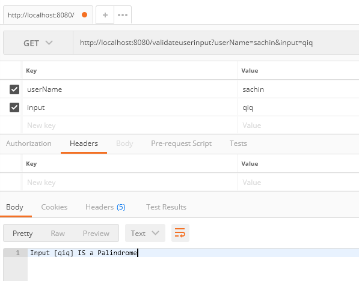

<H4> This project has single endpoint for checking whether the user input is palindrome or not.
A palindrome is a word, number, phrase, or other sequence of characters which reads the same backward as forward, such as madam or kayak
</H4>
Base URL: http://localhost:8080/validateuserinput
Parameter 1: User Name
Parameter 2: Input text

Example:

